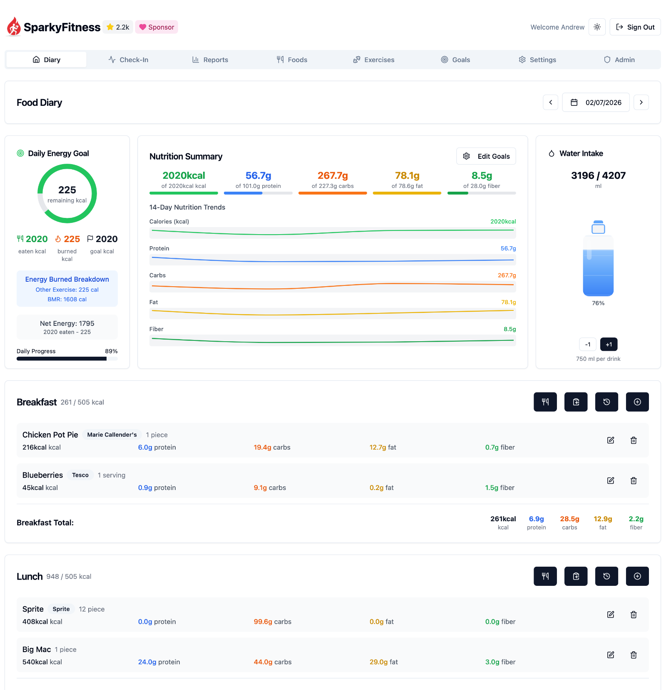

<div align="right">
  <details>
    <summary >🌐 Language</summary>
    <div>
      <div align="right">
        <p><a href="https://openaitx.github.io/view.html?user=CodeWithCJ&project=SparkyFitness&lang=en">English</a></p>
        <p><a href="https://openaitx.github.io/view.html?user=CodeWithCJ&project=SparkyFitness&lang=zh-CN">简体中文</a></p>
        <p><a href="https://openaitx.github.io/view.html?user=CodeWithCJ&project=SparkyFitness&lang=zh-TW">繁體中文</a></p>
        <p><a href="https://openaitx.github.io/view.html?user=CodeWithCJ&project=SparkyFitness&lang=ja">日本語</a></p>
        <p><a href="https://openaitx.github.io/view.html?user=CodeWithCJ&project=SparkyFitness&lang=ko">한국어</a></p>
        <p><a href="https://openaitx.github.io/view.html?user=CodeWithCJ&project=SparkyFitness&lang=hi">हिन्दी</a></p>
        <p><a href="https://openaitx.github.io/view.html?user=CodeWithCJ&project=SparkyFitness&lang=th">ไทย</a></p>
        <p><a href="https://openaitx.github.io/view.html?user=CodeWithCJ&project=SparkyFitness&lang=fr">Français</a></p>
        <p><a href="https://openaitx.github.io/view.html?user=CodeWithCJ&project=SparkyFitness&lang=de">Deutsch</a></p>
        <p><a href="https://openaitx.github.io/view.html?user=CodeWithCJ&project=SparkyFitness&lang=es">Español</a></p>
        <p><a href="https://openaitx.github.io/view.html?user=CodeWithCJ&project=SparkyFitness&lang=it">Italiano</a></p>
        <p><a href="https://openaitx.github.io/view.html?user=CodeWithCJ&project=SparkyFitness&lang=ru">Русский</a></p>
        <p><a href="https://openaitx.github.io/view.html?user=CodeWithCJ&project=SparkyFitness&lang=pt">Português</a></p>
        <p><a href="https://openaitx.github.io/view.html?user=CodeWithCJ&project=SparkyFitness&lang=nl">Nederlands</a></p>
        <p><a href="https://openaitx.github.io/view.html?user=CodeWithCJ&project=SparkyFitness&lang=pl">Polski</a></p>
        <p><a href="https://openaitx.github.io/view.html?user=CodeWithCJ&project=SparkyFitness&lang=ar">العربية</a></p>
        <p><a href="https://openaitx.github.io/view.html?user=CodeWithCJ&project=SparkyFitness&lang=fa">فارسی</a></p>
        <p><a href="https://openaitx.github.io/view.html?user=CodeWithCJ&project=SparkyFitness&lang=tr">Türkçe</a></p>
        <p><a href="https://openaitx.github.io/view.html?user=CodeWithCJ&project=SparkyFitness&lang=vi">Tiếng Việt</a></p>
        <p><a href="https://openaitx.github.io/view.html?user=CodeWithCJ&project=SparkyFitness&lang=id">Bahasa Indonesia</a></p>
      </div>
    </div>
  </details>
</div>

# SparkyFitness

A self-hosted, privacy-first alternative to MyFitnessPal. Track nutrition, exercise, body metrics, and health data while keeping full control of your data.



SparkyFitness is a self-hosted fitness tracking platform made up of:

- A backend server (API + data storage)
- A web-based frontend
- Native mobile apps for iOS and Android

It stores and manages health data on infrastructure you control, without relying on third party services.

## Core Features

- Nutrition, exercise, hydration, sleep, fasting, mood and body measurement tracking
- Goal setting and daily check-ins
- Interactive charts and long-term reports
- Multiple user profiles and family access
- Light and dark themes
- OIDC, TOTP, Passkey, MFA etc.

## Health & Device Integrations

SparkyFitness can sync data from multiple health and fitness platforms:

- **Apple Health** (iOS)
- **Google Health Connect** (Android)
- **Fitbit**
- **Garmin Connect**
- **Withings**
- **Polar Flow** (partially tested)
- **Hevy** (not tested)
- **OpenFoodFacts**
- **USDA**
- **Fatsecret**
- **Nutritioninx**
- **Mealie**
- **Tandoor**
- **Strava** (partially tested)

Integrations automatically sync activity data such as steps, workouts, and sleep, along with health metrics like weight and body measurements, to your SparkyFitness server.

## Optional AI Features (Beta)

SparkyAI provides a conversational interface for logging data and reviewing progress.

- Log food, exercise, body stats, and steps via chat
- Upload food images for automatic meal logging
- Retains conversation history for follow ups

Note: AI features are currently in beta.

## Quick Start (Server)

Get a SparkyFitness server running in minutes using Docker Compose.

```bash
# 1. Create a new folder
mkdir sparkyfitness && cd sparkyfitness

# 2. Download Docker files only
curl -L -o docker-compose.yml https://github.com/CodeWithCJ/SparkyFitness/releases/latest/download/docker-compose.prod.yml
curl -L -o .env https://github.com/CodeWithCJ/SparkyFitness/releases/latest/download/default.env.example

# 3. (Optional) Edit .env to customize database credentials, ports, etc.

# 4. Start the app
docker compose pull && docker compose up -d

# Access application at http://localhost:8080
```

## Build from Source

Run SparkyFitness directly on your machine without Docker. You will need Node.js, pnpm, and a running PostgreSQL instance.

### Prerequisites

- **Node.js** 24 or later
- **pnpm** — install with `npm install -g pnpm`
- **PostgreSQL** 17 or later

### 1. Clone the repository

```bash
git clone https://github.com/CodeWithCJ/SparkyFitness.git
cd SparkyFitness
```

### 2. Install dependencies

```bash
pnpm install
```

### 3. Configure environment variables

Copy the example env file to the repo root and fill in your values:

**Linux / macOS**
```bash
cp docker/.env.example .env
```

**Windows (PowerShell)**
```powershell
Copy-Item docker\.env.example .env
```

Required values to set in `.env`:

| Variable | Description |
|---|---|
| `SPARKY_FITNESS_DB_HOST` | PostgreSQL host — use `localhost` for local installs |
| `SPARKY_FITNESS_DB_NAME` | Database name (e.g. `sparkyfitness_db`) |
| `SPARKY_FITNESS_DB_USER` | Superuser used for migrations (e.g. `sparky`) |
| `SPARKY_FITNESS_DB_PASSWORD` | Superuser password |
| `SPARKY_FITNESS_APP_DB_USER` | App user with limited privileges (e.g. `sparky_app`) |
| `SPARKY_FITNESS_APP_DB_PASSWORD` | App user password |
| `SPARKY_FITNESS_FRONTEND_URL` | Set to `http://localhost:8080` for local builds |
| `SPARKY_FITNESS_API_ENCRYPTION_KEY` | 64-character hex string — generate with `openssl rand -hex 32` or `node -e "console.log(require('crypto').randomBytes(32).toString('hex'))"` |
| `BETTER_AUTH_SECRET` | Strongly recommended — auto-generated if absent but sessions will not survive server restarts. Signs sessions and encrypts 2FA/TOTP data. **Never change after users have enabled 2FA or they will be locked out.** |

> **Note:** The default `SPARKY_FITNESS_DB_HOST` in the example file is set to a Docker service name. Change it to `localhost` for a local install.

### 4. Set up PostgreSQL

Create the superuser and database that match your `.env` values.

**Linux**
```bash
sudo -u postgres createuser --pwprompt sparky
sudo -u postgres createdb sparkyfitness_db --owner sparky
```

**macOS (Homebrew)** — drop the `sudo -u postgres` prefix if your current user already has PostgreSQL superuser rights:
```bash
createuser --pwprompt sparky
createdb sparkyfitness_db --owner sparky
```

**Windows** — open a terminal and use `psql` as the `postgres` user (adjust the path to match your PostgreSQL install):
```powershell
psql -U postgres -c "CREATE ROLE sparky WITH LOGIN PASSWORD 'yourpassword';"
psql -U postgres -c "CREATE DATABASE sparkyfitness_db OWNER sparky;"
```

The `sparky_app` application user is created automatically by the server on first startup — you do not need to create it manually. Database migrations also run automatically on server start.

### 5. Start the backend server

```bash
cd SparkyFitnessServer
pnpm start
```

The API server starts on port `3010` by default. On first run it applies all migrations and creates the app database user. API docs are available at `http://localhost:3010/api/api-docs/swagger`.

### 6. Start the frontend

Open a second terminal from the repo root:

```bash
cd SparkyFitnessFrontend
pnpm dev
```

The web app starts on port `8080` by default. Open `http://localhost:8080` in your browser.

### Port summary

| Service | Default URL |
|---|---|
| Backend API | `http://localhost:3010` |
| Frontend | `http://localhost:8080` |
| API Docs | `http://localhost:3010/api/api-docs/swagger` |

## 🎥 Video Tutorial

[](https://www.youtube.com/watch?v=B13IiL2DeQc)

Quick 2-minute tutorial showing how to install SparkyFitness (self-hosted fitness tracker).


## Documentation

For full installation guides, configuration options, and development docs, please visit our [Documentation Site](https://codewithcj.github.io/SparkyFitness/).

### Quick Links

- **[Installation Guide](https://codewithcj.github.io/SparkyFitness/install/docker-compose)** - Deployment and configurations
- **[Features Overview](https://codewithcj.github.io/SparkyFitness/features)** - Complete feature documentation
- **[Development Workflow](https://codewithcj.github.io/SparkyFitness/developer/getting-started)** - Developer guide and contribution process
- **[iOS App Info](https://github.com/CodeWithCJ/SparkyFitness/wiki/Apple-Health-Integration)** and **[Android App Info](https://github.com/CodeWithCJ/SparkyFitness/wiki/Android-Mobile-App)**

### Need Help?

- Post in Github issues/discussion.
- For faster response and get help from other community memebers **[Join our Discord](https://discord.gg/vcnMT5cPEA)**

## Star History

<a href="https://star-history.com/#CodeWithCJ/SparkyFitness&Date">
  <picture>
    <source media="(prefers-color-scheme: dark)" srcset="https://api.star-history.com/svg?repos=CodeWithCJ/SparkyFitness&type=Date&theme=dark" />
    <source media="(prefers-color-scheme: light)" srcset="https://api.star-history.com/svg?repos=CodeWithCJ/SparkyFitness&type=Date" />
    
  </picture>
</a>

## Translations

**[Weblate Translations](https://hosted.weblate.org/engage/sparkyfitness)**

<a href="https://hosted.weblate.org/engage/sparkyfitness/">

</a>

## Repository activity


## Contributors

<a href="https://github.com/CodeWithCJ/SparkyFitness/graphs/contributors">
  
</a>

## ⚠️ Known Issues / Beta Features ⚠️

SparkyFitness is under active development.
Breaking changes may occur between releases.

- Auto-updating containers is not recommended
- Always review release notes before upgrading

The following features are currently in beta and may not have been thoroughly tested. Expect potential bugs or incomplete functionality:

- AI Chatbot
- Family & Friends access
- API documentation
