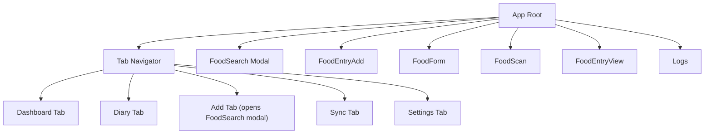
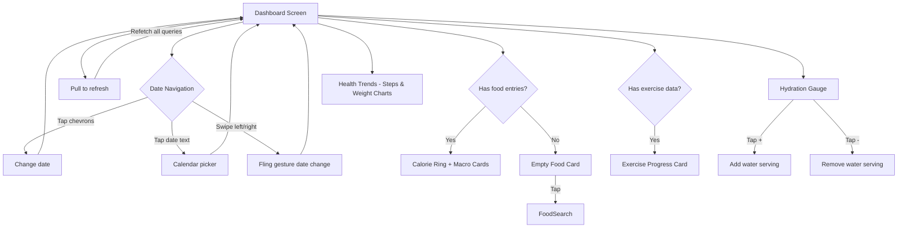
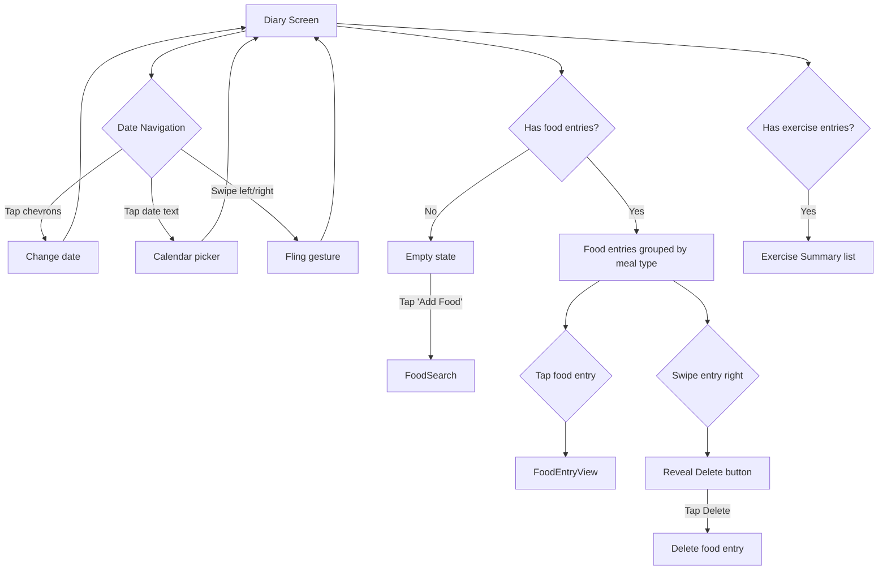
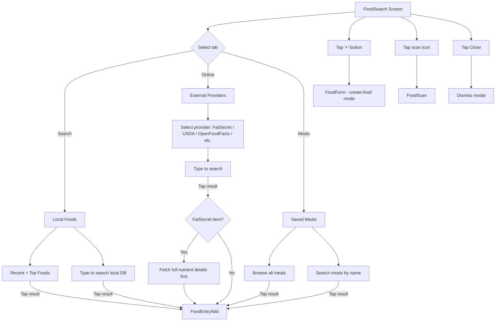
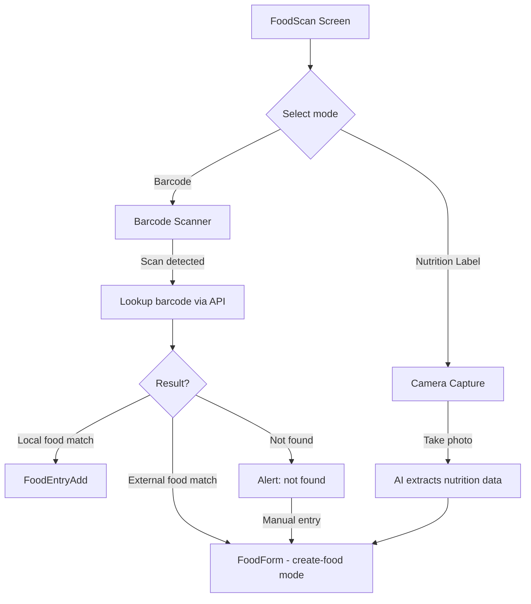
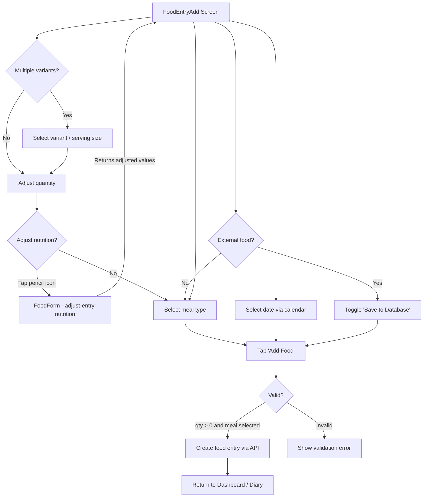
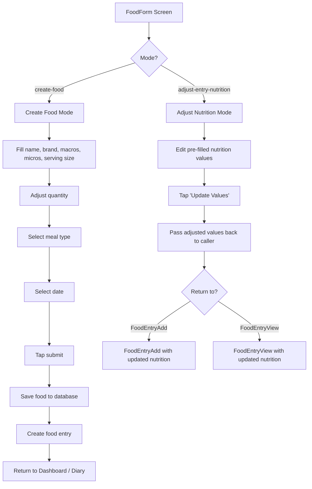
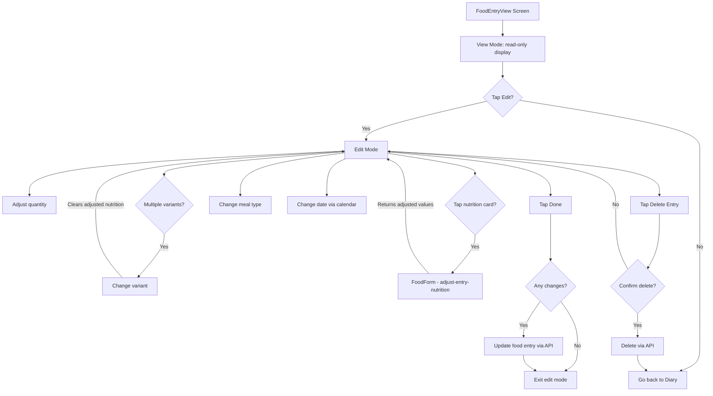
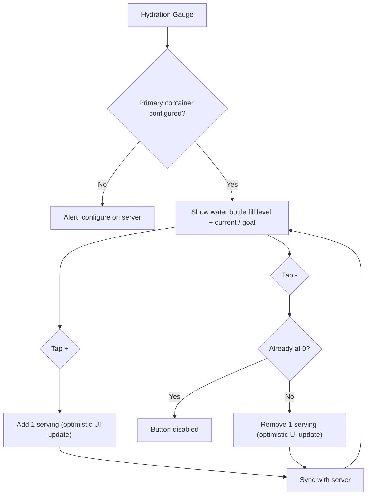
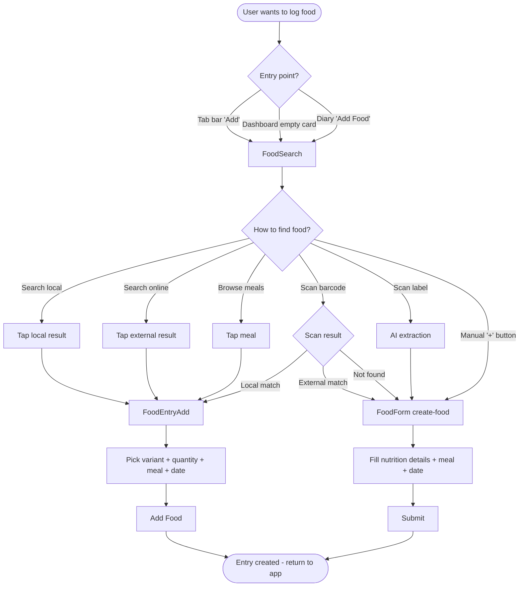

# User Flows

## App Navigation Structure

---

## Dashboard

---

## Diary

---

## Food Search

---

## Food Scan

---

## Food Entry Add

---

## Food Form

---

## Food Entry View / Edit

---

## Water Intake

---

## End-to-End: Adding a Food Entry

This combines the most common path through the app.

