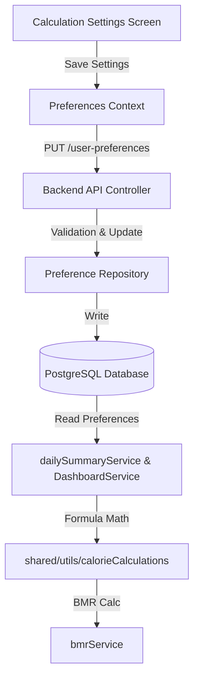

# Technical Design: Body Recomposition & Calorie Deficit Management

This document outlines the technical design for implementing **Body Recomposition and Calorie Deficit Management** in SparkyFitness. It covers database changes, backend service updates, shared calculation logic, frontend context expansion, and UI settings screens.

---

## 1. Architecture Overview

To calculate the adjusted calorie target based on the body recomposition goal, the system needs to coordinate database settings, BMR/RMR calculations, and UI displays:



---

## 2. Database Schema Changes

We will add three new columns to the `public.user_preferences` table via a new migration:

- `goal_mode`: `VARCHAR(50)` defaulting to `'maintain'`
- `goal_mode_calculation_method`: `VARCHAR(50)` defaulting to `'manual'`
- `goal_mode_custom_percentage`: `INTEGER` defaulting to `0`

### Database Migration File
We will create `SparkyFitnessServer/db/migrations/20260612153000_add_goal_mode_to_user_preferences.sql`:

```sql
-- Migration to add goal mode and deficit settings to user preferences
ALTER TABLE public.user_preferences
  ADD COLUMN goal_mode VARCHAR(50) NOT NULL DEFAULT 'maintain',
  ADD COLUMN goal_mode_calculation_method VARCHAR(50) NOT NULL DEFAULT 'manual',
  ADD COLUMN goal_mode_custom_percentage INTEGER NOT NULL DEFAULT 0;
```

We will also update `db_schema_backup.sql` by adding these columns inside the `CREATE TABLE public.user_preferences` statement to maintain structural integrity.

---

## 3. Shared Calculations (`@workspace/shared`)

We will centralize the calculations in the shared package to ensure perfect consistency between the backend API and frontend settings preview.

### File: `shared/src/utils/calorieCalculations.ts`

We will add the following types and functions:

```typescript
export type GoalMode = 'maintain' | 'recomp' | 'cut' | 'high_cut' | 'manual';
export type GoalModeCalculationMethod = 'adaptive' | 'manual';

// Deficit percentage mapping
export function getGoalModeDeficit(goalMode: string, customPercentage: number = 0): number {
  switch (goalMode) {
    case 'recomp':
      return 0.10;
    case 'cut':
      return 0.15;
    case 'high_cut':
      return 0.20;
    case 'manual':
      return Math.min(40, Math.max(0, customPercentage)) / 100;
    case 'maintain':
    default:
      return 0.0;
  }
}

// Unified Minimum Metabolism (RMR) function
export function calculateMinimumMetabolism(
  weightKg: number,
  heightCm: number,
  age: number,
  gender: 'male' | 'female',
  bodyFatPercentage?: number | null,
  bmrAlgorithm: string = 'Mifflin-St Jeor',
  calculateBmrFn?: (
    algorithm: any,
    weight: any,
    height: any,
    age: any,
    gender: any,
    bodyFatPercentage: any
  ) => number
): number {
  if (bodyFatPercentage && bodyFatPercentage > 0) {
    // Katch-McArdle Formula
    const lbm = weightKg * (1 - bodyFatPercentage / 100);
    return 370 + 21.6 * lbm;
  }
  
  if (calculateBmrFn) {
    return calculateBmrFn(bmrAlgorithm, weightKg, heightCm, age, gender, bodyFatPercentage);
  }
  
  // Inline Mifflin-St Jeor default if calculateBmrFn is omitted
  const genderOffset = gender === 'male' ? 5 : -161;
  return 10 * weightKg + 6.25 * heightCm - 5 * age + genderOffset;
}
```

We will also export a master calculator for the target:

```typescript
export interface CalorieTargetResult {
  target: number;
  rmr: number;
  baselineTdee: number;
  appliedDeficit: number;
  isBelowRmr: boolean;
  isBelowAbsoluteFloor: boolean;
  absoluteFloorValue: number;
  finalTarget: number;
  insufficientHistory: boolean;
  projectedWeeklyLossKg: number;
  projectedWeeklyLossPercent: number;
  lossSafetyZone: 'green' | 'yellow' | 'red';
}

export function computeCalorieTarget({
  goalMode,
  calculationMethod,
  customPercentage,
  bmr,
  activityLevelMultiplier,
  adaptiveTdee,
  adaptiveTdeeFallback,
  adaptiveTdeeDaysOfData,
  weightKg,
  heightCm,
  age,
  gender,
  bodyFatPercentage,
  bmrAlgorithm,
  currentGoalCalories,
  calculateBmrFn
}: {
  goalMode: string;
  calculationMethod: string;
  customPercentage: number;
  bmr: number;
  activityLevelMultiplier: number;
  adaptiveTdee: number | null;
  adaptiveTdeeFallback: boolean;
  adaptiveTdeeDaysOfData: number;
  weightKg: number;
  heightCm: number;
  age: number;
  gender: 'male' | 'female';
  bodyFatPercentage?: number | null;
  bmrAlgorithm?: string;
  currentGoalCalories: number;
  calculateBmrFn?: any;
}): CalorieTargetResult {
  const rmr = calculateMinimumMetabolism(weightKg, heightCm, age, gender, bodyFatPercentage, bmrAlgorithm, calculateBmrFn);
  const deficitPercent = getGoalModeDeficit(goalMode, customPercentage);
  
  let baselineTdee = currentGoalCalories;
  let insufficientHistory = false;
  
  if (calculationMethod === 'adaptive') {
    // Fallback if insufficient history (<14 days or fallback flag is true)
    if (adaptiveTdeeFallback || !adaptiveTdee || adaptiveTdeeDaysOfData < 14) {
      baselineTdee = Math.round(bmr * activityLevelMultiplier);
      insufficientHistory = true;
    } else {
      baselineTdee = adaptiveTdee;
    }
  }

  const calculatedTarget = baselineTdee * (1 - deficitPercent);
  const isBelowRmr = calculatedTarget < rmr;
  
  // Clinical Absolute Floors (1,200 kcal/day for females, 1,500 kcal/day for males)
  const absoluteFloorValue = gender === 'female' ? 1200 : 1500;
  const isBelowAbsoluteFloor = calculatedTarget < absoluteFloorValue;
  
  // Auto-adjust floor only if using Adaptive method. We raise target to the higher of RMR and absolute floor if using Adaptive.
  const safetyFloor = Math.max(rmr, absoluteFloorValue);
  const finalTarget = (calculationMethod === 'adaptive' && calculatedTarget < safetyFloor)
    ? Math.round(safetyFloor) 
    : Math.round(calculatedTarget);

  // Projected Weekly Weight Loss Rates (1 kg body tissue approx 7,700 kcal)
  const dailyDeficit = Math.max(0, baselineTdee - finalTarget);
  const projectedWeeklyLossKg = (dailyDeficit * 7) / 7700;
  const projectedWeeklyLossPercent = weightKg > 0 ? (projectedWeeklyLossKg / weightKg) * 100 : 0;
  
  // Safety Zone classification
  let lossSafetyZone: 'green' | 'yellow' | 'red' = 'green';
  if (projectedWeeklyLossPercent > 1.5) {
    lossSafetyZone = 'red';
  } else if (projectedWeeklyLossPercent > 1.0) {
    lossSafetyZone = 'yellow';
  }

  return {
    target: Math.round(calculatedTarget),
    rmr: Math.round(rmr),
    baselineTdee: Math.round(baselineTdee),
    appliedDeficit: Math.round(baselineTdee * deficitPercent),
    isBelowRmr,
    isBelowAbsoluteFloor,
    absoluteFloorValue,
    finalTarget,
    insufficientHistory,
    projectedWeeklyLossKg,
    projectedWeeklyLossPercent,
    lossSafetyZone
  };
}
```

We will update the `userPreferencesSchema`, `userPreferencesInitializerSchema`, and `userPreferencesMutatorSchema` in `shared/src/schemas/database/UserPreferences.zod.ts` to include the three new properties.

---

## 4. Backend Updates

### 4.1 validation and repositories (`preferenceRepository.ts` & `preferenceService.ts`)
- In `preferenceService.ts`, validate that `goal_mode` is one of `maintain`, `recomp`, `cut`, `high_cut`, `manual`.
- Validate `goal_mode_calculation_method` is one of `adaptive`, `manual`.
- Validate `goal_mode_custom_percentage` is an integer between `0` and `40`.
- In `preferenceRepository.ts`, update `updateUserPreferences` and `upsertUserPreferences` SQL queries and argument arrays to save and return the new columns.

### 4.2 Calorie Balance calculation (`dailySummaryService.ts`)
Update `computeCalorieBalance` to apply `computeCalorieTarget`:

```typescript
  // Load goal target adjustment after base goal resolves
  const goalMode = userPreferences?.goal_mode || 'maintain';
  const goalModeCalculationMethod = userPreferences?.goal_mode_calculation_method || 'manual';
  const goalModeCustomPercentage = userPreferences?.goal_mode_custom_percentage ?? 0;

  if (goalMode !== 'maintain' && bmr > 0) {
    const tz = userPreferences?.timezone || 'UTC';
    const age = userProfile ? (userAge(userProfile.date_of_birth ?? '', tz) ?? 30) : 30;
    const gender = (userProfile?.gender || 'male') as 'male' | 'female';
    const weightKg = parseFloat(String(measurements?.weight ?? '')) || CALORIE_CALCULATION_CONSTANTS.DEFAULT_WEIGHT_KG;
    const heightCm = parseFloat(String(measurements?.height ?? '')) || CALORIE_CALCULATION_CONSTANTS.DEFAULT_HEIGHT_CM;
    const bodyFat = measurements?.body_fat_percentage ? parseFloat(String(measurements.body_fat_percentage)) : null;
    const bmrAlgorithm = userPreferences?.bmr_algorithm || 'Mifflin-St Jeor';
    
    const activityLevel = userPreferences?.activity_level || 'not_much';
    const activityMultiplier = ActivityMultiplier[activityLevel] || 1.2;

    const result = computeCalorieTarget({
      goalMode,
      calculationMethod: goalModeCalculationMethod,
      customPercentage: goalModeCustomPercentage,
      bmr,
      activityLevelMultiplier: activityMultiplier,
      adaptiveTdee: adaptiveTdeeData ? adaptiveTdeeData.tdee : null,
      adaptiveTdeeFallback: adaptiveTdeeData ? adaptiveTdeeData.isFallback : true,
      adaptiveTdeeDaysOfData: adaptiveTdeeData ? (adaptiveTdeeData.daysOfData ?? 0) : 0,
      weightKg,
      heightCm,
      age,
      gender,
      bodyFatPercentage: bodyFat,
      bmrAlgorithm,
      currentGoalCalories: goalCalories,
      calculateBmrFn: bmrService.calculateBmr
    });
    
    goalCalories = result.finalTarget;
  }
```

### 4.3 Dashboard Statistics (`DashboardService.ts`)
Apply the identical calculation to `finalGoalCalories` when `goalMode !== 'maintain'` to ensure that external dashboard widgets display the correct target.

---

## 5. Frontend Updates

### 5.1 Context and Types (`preferenceService.ts` & `PreferencesContext.tsx`)
- Update `UserPreferences` interface in `preferenceService.ts` to include the new columns.
- Update `PreferencesContextType` and `PreferencesContext` state in `PreferencesContext.tsx` to handle `goalMode`, `goalModeCalculationMethod`, and `goalModeCustomPercentage` (mapping snake_case API data to camelCase state).
- Update `saveAllPreferences` callback inside `PreferencesContext.tsx`.

### 5.2 Settings Screen UI (`CalculationSettings.tsx`)
We will create a new visual section titled **Goal Mode**:

1. **State Hooks**: Add hooks to track current values of Goal Mode, Calculation Method, and Custom Percentage.
2. **Selectors**:
   - Calculation Method: Toggle group or select dropdown containing `Adaptive` and `Manual`. Calculation Method is disabled/dimmed when Goal Mode is `Maintain (0%)`.
   - Goal Mode: Select dropdown containing presets `Maintain (0%)`, `Body Recomp (-10%)`, `Cut (-15%)`, `High Cut (-20%)`, and `Manual (custom %)`.
   - Custom Percentage Input: Number input (bounded 0–40%) displayed when Goal Mode is `Manual`.
3. **Live Preview Panel**:
   - Fetches the user's recent weight, height, BMR, and adaptive TDEE.
   - Computes live calculation outputs using `computeCalorieTarget` so that the preview updates instantly as selectors are toggled.
   - **Base Metric Handling**: Weight is processed in `kg` (from backend measurements) and height in `cm` as base metrics.
   - **Energy Unit localization (kcal vs. kJ)**: Displayed baseline TDEE, deficit, BMR/RMR, and calorie targets are converted using context's `convertEnergy(val, 'kcal', energyUnit)` utility for seamless localization.
   - **Weight Unit localization (kg vs. lbs)**: Projected absolute weekly loss is converted using `convertWeight(kgValue, 'kg', weightUnit)` to match the user's active weight display preference.
   - Renders a visual calculation chain: **Estimated TDEE → Applied Deficit → Calorie Target**.
   - **Projected Weekly Loss Rate display**: Shows absolute weekly projected loss (e.g., *~0.5 kg/week* or *~1.1 lbs/week*) and relative loss percentage (e.g., *0.7% of body weight/week*). Color-codes the value based on the safety zone:
     - **Green**: Recommended (0.3%–1.0%)
     - **Yellow**: Aggressive (1.0%–1.5%)
     - **Red**: Extreme (>1.5%)
4. **Coaching Recommendations & Clinical Warnings Panel**:
   - **Protein/Macro Tip**: Render mode-specific advice. (e.g., for Recomp: *Aim for 1.6–2.2g of protein per kg of body weight alongside resistance training to build muscle while losing fat.*)
   - **High Deficit Caution Warning**: Displayed if `customPercentage > 20` warning against excessive restriction.
   - **BMR Warning Banner**: Displays a warning callout if `calculationMethod === 'manual'` and `Calorie Target < RMR`.
   - **Clinical Absolute Floor Warning**: If `Calorie Target < absoluteFloorValue`, displays a strong medical safety alert: *"Your calorie target is below the clinical absolute safety floor of 1200 kcal/day (female) or 1500 kcal/day (male). Deficits below this level are generally not recommended without direct medical supervision."*
5. **Adaptive History Banner**:
   - Displays an informational banner when `calculationMethod === 'adaptive'` and recent tracking history spans less than 14 days, telling the user that adaptive precision will improve over time, along with compliance reminders (log weight $\ge 3$ times/week, log daily meals).

---

## 6. Verification and Test Strategy

- **Shared package tests**: Verify `computeCalorieTarget` against preset weights, body fats, deficit percentages, and biological genders.
- **Backend tests**: Add tests in `dailySummaryService.test.ts` mocking preferences for `recomp` deficit mode and asserting that the output daily goal calories match targets (with and without the safety floors).
- **Frontend test validation**: Ensure settings successfully persist on save and live preview operates in isolation.
